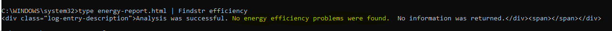

# Check-windows-power-Efficiency

To check the power efficiency in windows:

1. open the cmd as <b>an adminstrator<b>
2. run the following command in the cmd:
	```
	powercfg -energy
	```

	
3. wait until the energy-report.html file is created

4. run the following command to see the result:
	```
	type energy-report.html | Findstr efficiency
	```

